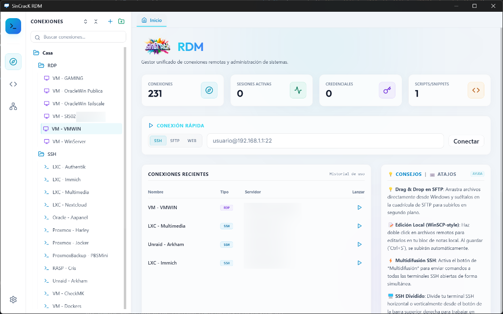

# 🌐 SinCracK RDM

Gestor unificado de conexiones remotas y administración de sistemas.



---

## ✨ Características Principales

### 📁 Gestión Avanzada de Conexiones
- **Árbol Jerárquico**: Organiza tus servidores por Carpetas y Subcarpetas.
- **Persistencia de Estados**: El estado de colapsado/abierto de las carpetas se guarda de forma persistente en `localStorage`. Por defecto, inician colapsadas para mantener el orden.
- **Acciones Globales**: Botones de **Desplegar todo** (`ChevronsUpDown`) y **Colapsar todo** (`ChevronsDownUp`) en un solo clic.
- **Buscador en Tiempo Real**: Filtra al instante tus cientos de servidores por nombre, IP o tipo.

### 🐚 Terminal SSH Integrada y Multitarea
- **Terminales Divididas**: Soporte para dividir terminales horizontal y verticalmente en la misma pestaña.
- **Buscador de Texto (`Ctrl + F`)**: Addon integrado para buscar y resaltar cadenas de texto dentro de la salida de la consola SSH.
- **Snippets / Comandos Rápidos**: Lanza consultas frecuentes (Uso de RAM, CPU, Docker, Disco) con un solo clic.
- **Bloc de Notas Integrado**: Guarda notas específicas por conexión con sincronización automática en base de datos. Accedido desde el Sidebar (clic derecho) o la cabecera flotante de la terminal activa.

### 📂 Explorador SFTP Avanzado (Estilo WinSCP)
- Navegación de archivos rápida y visual.
- Barra de progreso interactiva para descargas y subidas en segundo plano.
- **Edición en Caliente**: Abre archivos de texto remotos en tu editor local favorito (VS Code, Notepad++, etc.) con sincronización automática: al guardar los cambios localmente, se suben al servidor SSH al instante.

### 🖥️ Conexión RDP Nativa (Windows)
- Lanzamiento automático del Escritorio Remoto oficial de Windows (`mstsc.exe`).
- **Autenticación Invisible**: Inyección temporal de contraseñas en el almacén de credenciales de Windows (`cmdkey`). Se eliminan de forma segura una vez que se cierra la sesión RDP para evitar dejar rastros.

### 🛠️ Herramientas de Red Integradas
- **Ping Gráfico**: Monitorización visual interactiva en tiempo real con gráfico de latencia y tiempos de respuesta.
- **Escáner de Puertos**: Escáner ultrarrápido y paralelo de puertos TCP con límite de concurrencia ajustable.
- **Wake on Lan (WoL)**: Envío de Magic Packets UDP para encender servidores apagados directamente desde la app.

### 🔒 Máxima Seguridad y Cifrado
- Base de datos local totalmente encriptada usando **AES-256-CBC**.
- **Doble Capa de Cifrado**: Cifrado por defecto transparente mediante una clave única generada por hardware (`MACHINE_KEY`), o configuración de **Contraseña Maestra** personalizada para proteger la base de datos contra accesos no autorizados en otros PCs.

---

## 🛠️ Stack Tecnológico

- **Frontend**: React 18, TypeScript, Tailwind CSS, Lucide React (iconos).
- **Core / Shell**: Electron 30, Node.js (con librerías nativas como `ssh2`, `net`, `dgram`).
- **Terminal**: xterm.js (con addons `xterm-addon-fit` y `xterm-addon-search`).
- **Empaquetado**: electron-builder.

---

## 🚀 Instalación y Desarrollo

Para ejecutar el proyecto en tu entorno local de desarrollo:

### Requisitos previos
- Node.js (versión 18 o superior recomendada).

### Pasos
1. Clona el repositorio:
   ```bash
   git clone https://github.com/sincrack/sincrackrdm.git
   cd sincrackrdm
   ```

2. Instala las dependencias:
   ```bash
   npm install
   ```

3. Inicia la aplicación en modo desarrollo:
   ```bash
   npm run dev
   ```

---

## 📦 Compilación y Empaquetado

Para generar los instaladores de producción de la aplicación:

### Windows 💻
Genera tanto el instalador instalable (`SinCracK RDM Setup 1.0.0.exe`) como una versión **100% portable** (un único ejecutable `SinCracK RDM 1.0.0.exe` que no requiere instalación ni privilegios de administrador) en la carpeta `release/`:
```bash
npm run build
```

### macOS 🍏 (Ejecutar en macOS)
- **Apple Silicon (ARM64 - M1/M2/M3)**:
  ```bash
  npm run build -- --mac --arm64
  ```
- **Intel (x64)**:
  ```bash
  npm run build -- --mac --x64
  ```
- **Universal**:
  ```bash
  npm run build -- --mac --universal
  ```

### Linux 🐧
Genera un archivo ejecutable `.AppImage` (ejecutar en Linux):
```bash
npm run build -- --linux
```

---

## 💾 Ubicación de la Base de Datos

Las credenciales y conexiones se guardan localmente y de forma segura en:
- **Windows**: `%APPDATA%/sincrack-rdm/sincrack-rdm.db`
- **Linux**: `~/.config/sincrack-rdm/sincrack-rdm.db`
- **macOS**: `~/Library/Application Support/sincrack-rdm/sincrack-rdm.db`

---

## 📄 Licencia

Este proyecto está bajo la Licencia MIT.
